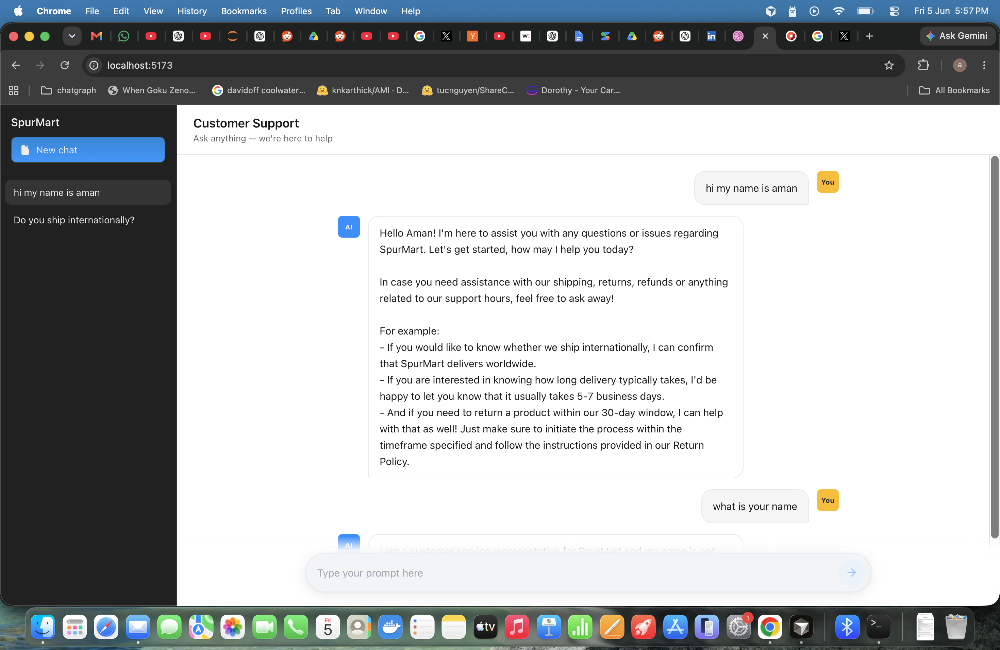

# SpurMart Support Chat

AI-powered customer support chat platform built as a take-home assignment for the **Founding Full-Stack Engineer** role at **Spur**.

The application demonstrates a production-oriented full-stack implementation: a SvelteKit frontend, an Express + TypeScript API, persistent conversations via Prisma/SQLite, and a pluggable LLM layer supporting local (Ollama) and cloud (Groq, OpenAI) providers.



---

## Project Overview

SpurMart Support Chat is a fictional ecommerce support assistant. Users can start conversations, ask policy questions (shipping, returns, refunds, support hours), and receive context-aware replies grounded in a curated FAQ-style knowledge base embedded in the system prompt.

The project is structured as a monorepo-style workspace:

- **`/`** — Node.js + TypeScript backend (Express API)
- **`/frontend`** — SvelteKit + TypeScript chat UI

The assignment prioritizes clean architecture, type safety, persistence, and realistic error handling over feature breadth.

---

## Features

### Frontend (SvelteKit)

- ChatGPT-style UI with dark sidebar and light chat panel
- User messages aligned right; AI messages aligned left
- Scrollable conversation area with auto-scroll to newest message
- Floating pill-shaped chat input fixed to the bottom
- Enter to send; send button disabled while waiting
- "Agent is typing..." indicator during LLM requests
- Session persistence via `localStorage`
- Conversation sidebar with previous chats
- "New Chat" to start a fresh session
- Active conversation highlighting
- History restored on page load

### Backend (Express + TypeScript)

- REST API for messaging and conversation management
- Prisma ORM with SQLite
- Conversation and message persistence
- Automatic conversation titling from the first user message (max 50 characters)
- Zod input validation
- Centralized error handling middleware
- Request logging middleware
- Layered architecture (routes → controllers → services → repositories)

### LLM Layer

- Provider abstraction (`LLMProvider` interface)
- Ollama support for local development
- Groq support for free hosted inference (recommended for deployment)
- OpenAI support via environment configuration
- Last 10 messages included as conversation context
- SpurMart FAQ knowledge base in system prompt
- Graceful fallback when LLM providers fail

---

## Architecture

### High-level flow

```
User
  ↓
Svelte Frontend (SvelteKit)
  ↓
Express API
  ↓
Prisma ORM
  ↓
SQLite
```

### LLM flow

```
Express API
  ↓
Chat Service
  ↓
LLM Factory → LLMProvider
  ↓
Ollama / Groq / OpenAI
```

### Component responsibilities

| Layer | Responsibility |
|---|---|
| **Frontend** | UI, session state, API calls, localStorage |
| **Express API** | HTTP routing, validation, orchestration |
| **Services** | Business logic, LLM orchestration |
| **Repositories** | Database access |
| **Prisma** | Schema, migrations, query client |
| **SQLite** | Persistent storage |
| **LLM Layer** | Provider abstraction, prompt construction, error handling |

---

## Backend Structure

```
src/
├── server.ts              # App entry point
├── app.ts                 # Express app wiring
├── routes/                # HTTP route definitions
├── controllers/           # Request/response handling
├── services/              # Business logic
│   └── llm/               # LLM provider abstraction
│       ├── llm.interface.ts
│       ├── ollama.provider.ts
│       ├── openai.provider.ts
│       ├── groq.provider.ts
│       └── llm.factory.ts
├── repositories/          # Data access layer
├── middleware/            # Logging, validation, errors
├── types/                 # Shared TypeScript types & Zod schemas
└── utils/                 # Env, Prisma client, helpers
```

| Directory | Responsibility |
|---|---|
| `routes/` | Maps HTTP paths to controller handlers; attaches validation middleware |
| `controllers/` | Parses validated input, calls services, returns HTTP responses |
| `services/` | Core business rules (send message, load history, list conversations) |
| `repositories/` | Encapsulates Prisma queries; no HTTP or LLM logic |
| `middleware/` | Cross-cutting concerns: logging, Zod validation, error formatting |
| `services/llm/` | Isolated LLM integration; the rest of the app never calls Ollama/OpenAI directly |

---

## Frontend Structure

```
frontend/src/
├── routes/
│   └── +page.svelte       # Main layout (sidebar + chat)
├── lib/
│   ├── api/               # API client
│   ├── components/        # UI components
│   │   ├── Sidebar.svelte
│   │   ├── ConversationList.svelte
│   │   ├── ConversationItem.svelte
│   │   ├── ChatWindow.svelte
│   │   ├── MessageBubble.svelte
│   │   ├── ChatInput.svelte
│   │   └── TypingIndicator.svelte
│   ├── types/
│   └── utils/             # Session localStorage helpers
```

During development, the frontend proxies `/api` requests to `http://localhost:3000`.

---

## Database Schema

### Conversation

| Field | Type | Description |
|---|---|---|
| `id` | `String` (UUID) | Primary key |
| `title` | `String` | Set from first user message; empty until first message |
| `createdAt` | `DateTime` | Creation timestamp |

### Message

| Field | Type | Description |
|---|---|---|
| `id` | `String` (UUID) | Primary key |
| `conversationId` | `String` | Foreign key → `Conversation.id` |
| `sender` | `String` | `"user"` or `"ai"` |
| `text` | `String` | Message content |
| `createdAt` | `DateTime` | Creation timestamp |

### Relationships

- One **Conversation** has many **Messages**
- Deleting a conversation cascades to its messages (`onDelete: Cascade`)
- `conversationId` is indexed for efficient history lookups

---

## API Endpoints

### `POST /chat/message`

Send a user message and receive an AI reply.

**Request**

```json
{
  "message": "Do you ship internationally?",
  "sessionId": "optional-uuid"
}
```

**Response**

```json
{
  "reply": "Yes, we ship worldwide.",
  "sessionId": "550e8400-e29b-41d4-a716-446655440000"
}
```

- Omits `sessionId` to start a new conversation
- Persists both user and AI messages
- Sets conversation title from the first user message

---

### `GET /chat/history/:sessionId`

Retrieve all messages for a conversation.

**Response**

```json
{
  "sessionId": "550e8400-e29b-41d4-a716-446655440000",
  "messages": [
    {
      "id": "msg-uuid",
      "sender": "user",
      "text": "Do you ship internationally?",
      "createdAt": "2026-06-05T12:00:00.000Z"
    },
    {
      "id": "msg-uuid",
      "sender": "ai",
      "text": "Yes, we ship worldwide.",
      "createdAt": "2026-06-05T12:00:01.000Z"
    }
  ]
}
```

---

### `GET /chat/conversations`

List all conversations that have a title (i.e., at least one user message).

**Response**

```json
[
  {
    "id": "550e8400-e29b-41d4-a716-446655440000",
    "title": "Do you ship internationally?",
    "createdAt": "2026-06-05T12:00:00.000Z"
  }
]
```

---

### `GET /health`

Health check endpoint.

**Response**

```json
{
  "status": "ok"
}
```

---

## LLM Integration

### Provider abstraction

All LLM calls go through a single interface:

```typescript
interface LLMProvider {
  generateReply(history: ChatMessage[], userMessage: string): Promise<string>;
}
```

Providers are selected at runtime via `LLM_PROVIDER`:

| Value | Provider |
|---|---|
| `ollama` | Local Ollama (`POST /api/chat`) |
| `groq` | Groq OpenAI-compatible API |
| `openai` | OpenAI Node SDK |

### Groq (recommended for production)

- Free tier available at [console.groq.com](https://console.groq.com)
- Works on Render without local GPU infrastructure
- Uses OpenAI-compatible SDK pointed at `https://api.groq.com/openai/v1`
- Default model: `llama-3.3-70b-versatile`

### Ollama (local development)

- Default provider for zero-cost local development
- Configurable model via `OLLAMA_MODEL`
- Request timeout via `OLLAMA_TIMEOUT_MS`
- Handles connection failures, timeouts, and empty responses

### OpenAI (production option)

- Activated with `LLM_PROVIDER=openai`
- Requires `OPENAI_API_KEY`
- Handles rate limits, auth errors, timeouts, and API failures

### Conversation history

- The last **10 messages** from the conversation are sent as context
- Roles are mapped: `user` → user, `ai` → assistant
- The current user message is appended after history

### Prompt design

The system prompt encodes the SpurMart FAQ knowledge base:

- Shipping: worldwide, 5–7 business days
- Returns: 30 days
- Refunds: within 5 business days
- Support hours: Monday–Friday, 9am–6pm UTC

Behavior rules enforce natural tone, concise answers, correct agent/customer identity separation, and direct responses without robotic phrasing.

### Fallback behavior

On provider failure, the API returns a friendly message instead of throwing:

```
Sorry, our support assistant is temporarily unavailable.
```

---

## Environment Variables

Copy `.env.example` to `.env` in the project root:

```env
PORT=3000
DATABASE_URL="file:./dev.db"

# ollama | openai | groq
LLM_PROVIDER=groq

GROQ_API_KEY=gsk_your_groq_api_key_here
GROQ_MODEL=llama-3.3-70b-versatile
GROQ_TIMEOUT_MS=30000

OLLAMA_MODEL=qwen3:8b
OLLAMA_BASE_URL=http://localhost:11434
OLLAMA_TIMEOUT_MS=30000

OPENAI_API_KEY=your_openai_api_key_here
OPENAI_MODEL=gpt-4o-mini
OPENAI_TIMEOUT_MS=30000
```

| Variable | Required | Description |
|---|---|---|
| `PORT` | No | API server port (default: `3000`) |
| `DATABASE_URL` | Yes | SQLite connection string |
| `LLM_PROVIDER` | No | `ollama`, `groq`, or `openai` (default: `ollama`) |
| `GROQ_API_KEY` | When `LLM_PROVIDER=groq` | Groq API key |
| `GROQ_MODEL` | No | Groq model (default: `llama-3.3-70b-versatile`) |
| `GROQ_TIMEOUT_MS` | No | Groq request timeout |
| `OLLAMA_MODEL` | No | Ollama model name |
| `OLLAMA_BASE_URL` | No | Ollama API base URL |
| `OLLAMA_TIMEOUT_MS` | No | Ollama request timeout |
| `OPENAI_API_KEY` | When `LLM_PROVIDER=openai` | OpenAI API key |
| `OPENAI_MODEL` | No | OpenAI model name |
| `OPENAI_TIMEOUT_MS` | No | OpenAI request timeout |

---

## Local Setup

### Prerequisites

- Node.js 18+
- npm
- [Ollama](https://ollama.com/) (for local LLM development)

### 1. Clone and install

```bash
git clone <repository-url>
cd shopbot

# Backend
npm install

# Frontend
cd frontend
npm install
cd ..
```

### 2. Configure environment

```bash
cp .env.example .env
```

Edit `.env` as needed. For local development, `LLM_PROVIDER=ollama` is recommended.

### 3. Set up Ollama

```bash
# Start Ollama (if not already running)
ollama serve

# Pull a model (example)
ollama pull mistral:latest

# Verify
curl http://localhost:11434/api/tags
```

Update `OLLAMA_MODEL` in `.env` to match your installed model.

### 4. Initialize the database

```bash
npm run db:migrate
```

### 5. Start the backend

```bash
npm run dev
```

API available at `http://localhost:3000`.

### 6. Start the frontend

In a separate terminal:

```bash
cd frontend
npm run dev
```

UI available at `http://localhost:5173`.

### Production build

```bash
# Backend
npm run build
npm start

# Frontend
cd frontend
npm run build
npm run preview
```

---

## Error Handling

| Scenario | Behavior |
|---|---|
| **Empty message** | `400` — `"Message cannot be empty"` |
| **Message > 2000 chars** | `400` — validation error |
| **Invalid session ID** | `400` for malformed UUID; `404` if not found |
| **LLM timeout** | Friendly fallback response persisted as AI message |
| **LLM auth / rate limit** | Logged server-side; friendly fallback returned |
| **Ollama unreachable** | Logged server-side; friendly fallback returned |
| **Unexpected server error** | `500` with generic message via error middleware |

Validation is enforced with **Zod** at the route layer. LLM failures never crash the request — they degrade gracefully.

---

## Design Decisions

### Why SQLite?

- Zero external infrastructure for local development and review
- File-based persistence is simple to inspect (`prisma/dev.db`)
- Sufficient for a single-tenant demo and take-home scope
- Prisma makes migration to PostgreSQL straightforward

### Why Prisma?

- Type-safe database client generated from schema
- Declarative migrations and schema evolution
- Clean repository pattern without raw SQL
- Easy path to PostgreSQL for production

### Why abstract LLM providers?

- Application code depends on `LLMProvider`, not vendor SDKs
- Ollama enables free local development; Groq/OpenAI enable hosted production inference
- New providers (Anthropic, Azure OpenAI) can be added without touching chat logic
- Timeouts, prompt construction, and fallbacks are centralized

### Why persist conversation history?

- Enables multi-turn context-aware support
- Powers the sidebar conversation list
- Allows session restoration after page refresh
- Provides an audit trail of user and AI messages

---

## Scalability Considerations

| Area | Approach |
|---|---|
| **Conversation summarization** | Summarize older messages beyond the 10-message window to reduce token usage |
| **Redis caching** | Cache conversation lists and hot session history |
| **Rate limiting** | Per-IP or per-session limits on `/chat/message` |
| **Queues** | Offload LLM calls to a job queue (BullMQ, SQS) for async replies |
| **Multi-tenancy** | Add `tenantId` to conversations; scope queries and prompts per tenant |
| **PostgreSQL** | Replace SQLite for concurrent writes, replication, and production durability |

---

## Trade-offs

Decisions made due to assignment time constraints:

- **No authentication** — sessions are identified by UUID only; no user accounts
- **No streaming** — responses are returned in full after LLM completion
- **No attachment support** — text-only messaging
- **Single-node SQLite** — not suitable for high-concurrency production
- **In-memory session on frontend** — `localStorage` only; no cross-device sync
- **Fixed context window** — last 10 messages; no summarization of older context
- **FAQ in system prompt** — simple and effective for demo scope; a vector DB would scale better for large knowledge bases

---

## Future Improvements

- [ ] Server-Sent Events or WebSocket streaming for token-by-token replies
- [ ] User authentication and per-user conversation ownership
- [ ] Conversation deletion and rename from the sidebar
- [ ] PostgreSQL with connection pooling
- [ ] Redis-backed rate limiting and session cache
- [ ] RAG pipeline with embedding-based FAQ retrieval
- [ ] Conversation summarization for long threads
- [ ] Admin dashboard for conversation review
- [ ] Structured logging (pino) and OpenTelemetry tracing
- [ ] Docker Compose for one-command local setup
- [ ] CI pipeline with lint, typecheck, and integration tests

---

## Deployment

Production target: **Frontend on Vercel** + **Backend on Render**.

### Backend (Render)

See **[docs/RENDER_DEPLOYMENT.md](./docs/RENDER_DEPLOYMENT.md)** for the full guide.

| Setting | Value |
|---|---|
| Build Command | `npm install && npm run build && npx prisma migrate deploy` |
| Start Command | `npm start` |
| Health Check | `/health` |

Required environment variables:

```env
NODE_ENV=production
DATABASE_URL=file:./prisma/prod.db
LLM_PROVIDER=groq
GROQ_API_KEY=<your-groq-key>
FRONTEND_URL=https://<your-app>.vercel.app
```

> **Note:** Render's free tier uses ephemeral disk. SQLite data may not persist across redeploys. For production durability, migrate to PostgreSQL (steps in `docs/RENDER_DEPLOYMENT.md`).

### Frontend (Vercel)

The frontend uses `@sveltejs/adapter-vercel` and reads the backend URL from `PUBLIC_API_URL`.

1. Import the repo on [Vercel](https://vercel.com)
2. Set **Root Directory** to `frontend`
3. Framework Preset: **SvelteKit** (auto-detected)
4. Set environment variable:

```env
PUBLIC_API_URL=https://<your-service>.onrender.com
```

5. Deploy

### Verify production

```bash
# Backend health
curl https://<your-service>.onrender.com/health

# Send a test message
curl -X POST https://<your-service>.onrender.com/chat/message \
  -H "Content-Type: application/json" \
  -d '{"message": "Do you ship internationally?"}'
```

Open the Vercel URL in a browser and send a chat message.

### Environment summary

| Variable | Where | Purpose |
|---|---|---|
| `PUBLIC_API_URL` | Vercel | Render backend base URL |
| `OPENAI_API_KEY` | Render | LLM provider API key |
| `LLM_PROVIDER` | Render | `groq` for production (free hosted API) |
| `GROQ_API_KEY` | Render | Groq API key |
| `DATABASE_URL` | Render | SQLite or PostgreSQL connection |

---

## License

Built for evaluation purposes as part of the Spur take-home assignment.
